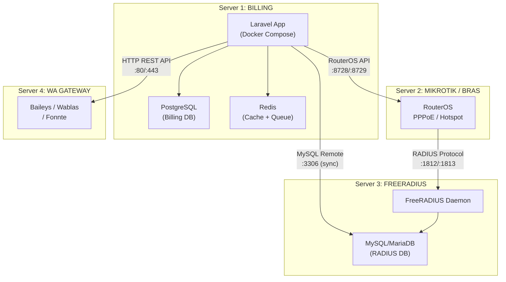
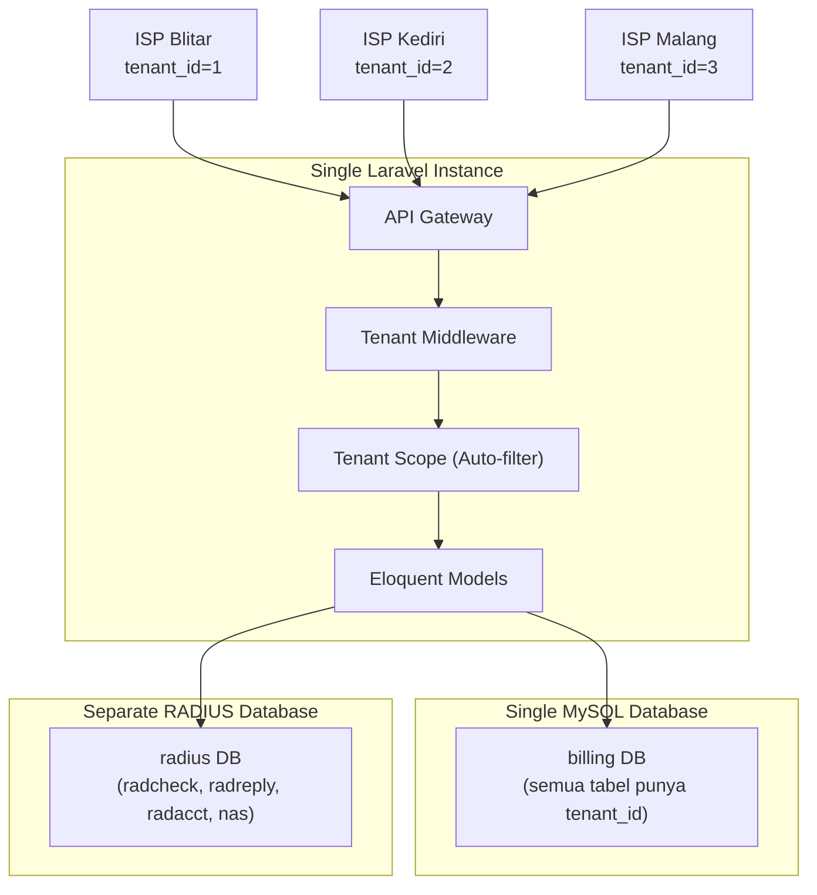
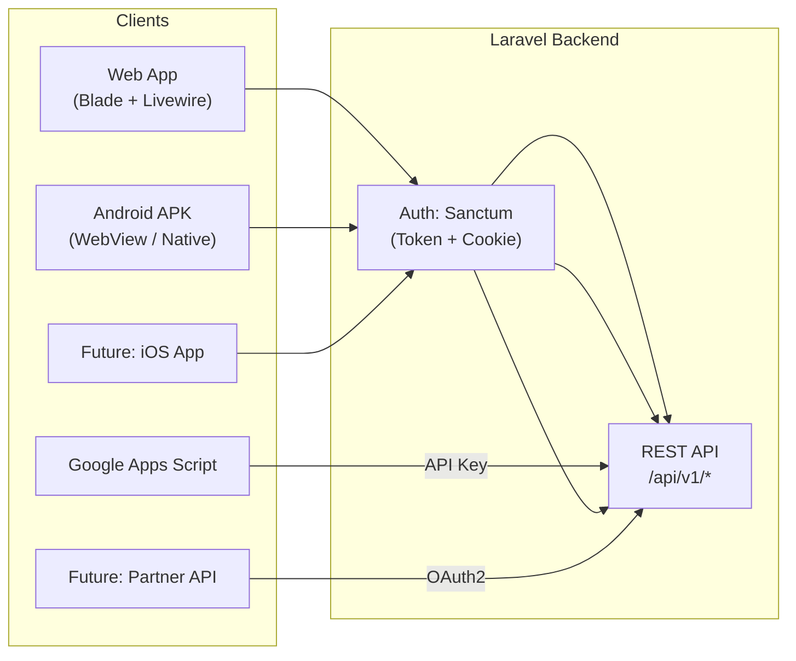
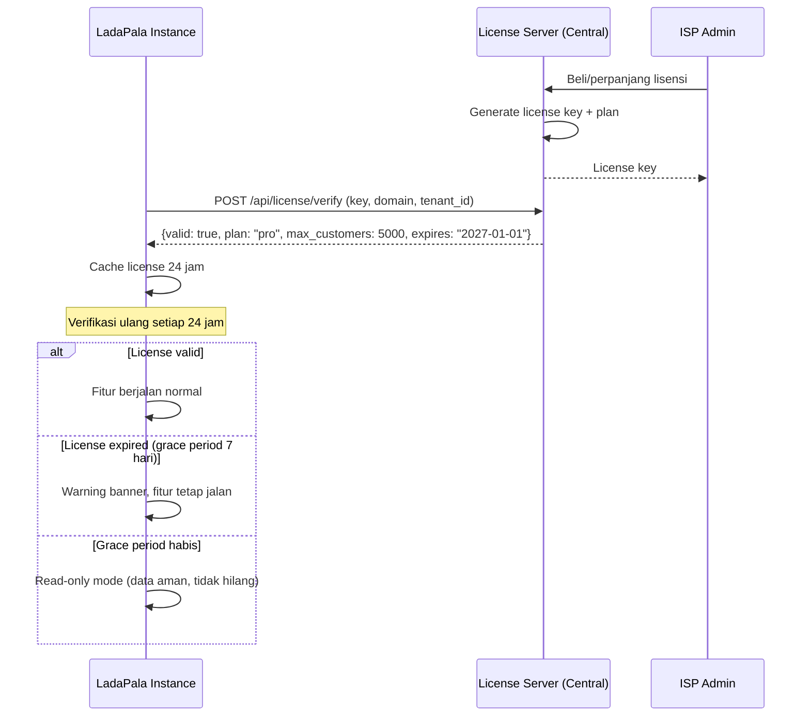

# Rewrite SISPEMB (LadaPala-Bill) ke Laravel Framework

## Ringkasan Proyek

Sistem Billing ISP **LadaPala-Bill (SISPEMB)** saat ini dibangun dengan **Vanilla PHP prosedural** + MySQL + jQuery. Proyek ini bertujuan melakukan **full rewrite** ke framework **Laravel 11** dengan arsitektur terdistribusi 4 server:

| Keputusan Arsitektur | Pilihan |
|:---|:---|
| **Framework** | Laravel 11 |
| **Architecture** | API-First (Backend API + Frontend terpisah) |
| **Multi-tenancy** | ✅ Ya — Single DB, tenant isolation via `tenant_id` |
| **Billing Database** | PostgreSQL (di server billing) |
| **RADIUS Database** | MySQL/MariaDB (di server FreeRADIUS terpisah) |
| **Frontend** | Blade + Livewire (consume own API) |
| **Deployment** | Docker Compose (billing server) |
| **Lisensi** | Subscription-based (menggantikan time-bomb) |
| **UI Theme** | Light mode default + Dark mode toggle (cached localStorage) |

### Arsitektur 4 Server Terdistribusi



**Komunikasi antar server:**

| Dari → Ke | Protokol | Port | Keterangan |
|:---|:---|:---:|:---|
| Billing → MikroTik | RouterOS API | 8728/8729 | Isolir, sync PPPoE, monitoring |
| Billing → FreeRADIUS DB | MySQL remote | 3306 | Sync radcheck/radreply/radusergroup |
| Billing → WA Gateway | HTTP REST API | 80/443 | Kirim pesan tagihan, notifikasi |
| MikroTik → FreeRADIUS | RADIUS protocol | 1812/1813 | Auth PPPoE/Hotspot |

**Keuntungan arsitektur terdistribusi:**
- ✅ Billing down → internet pelanggan tetap jalan (RADIUS independen)
- ✅ FreeRADIUS tetap pakai MySQL (native, paling stabil)
- ✅ Billing pakai PostgreSQL (optimal untuk multi-tenant + JSONB + Row-Level Security)
- ✅ WA Gateway bisa di-scale terpisah
- ✅ Setiap server bisa di-backup/update independen

> [!IMPORTANT]
> Keputusan multi-tenant dan API-first **menambah kompleksitas signifikan** tetapi memberikan fondasi yang sangat kuat untuk scaling, update, dan maintenance jangka panjang. Estimasi pengerjaan: **12-16 minggu**.

---

## Keputusan Arsitektur (Resolved)

### 1. Multi-Tenant SaaS Architecture

Setiap ISP (tenant) berbagi satu instance aplikasi, tapi data terisolasi sepenuhnya.

**Pendekatan: Single Database + `tenant_id` column** (bukan database-per-tenant)



**Keuntungan pendekatan ini:**
- ✅ Satu kali deploy = semua tenant terupdate
- ✅ Migrasi database cukup sekali
- ✅ Backup & maintenance lebih simpel
- ✅ Bisa scale ke ratusan ISP tanpa overhead server baru
- ✅ Shared resources (router profiles, template, dll) bisa di-share antar tenant

**Implementasi teknis:**
```php
// Setiap model yang tenant-aware otomatis difilter
class Customer extends Model {
    use BelongsToTenant; // Auto-scope semua query dengan tenant_id
}

// Middleware mendeteksi tenant dari subdomain atau header
// blitar.ladapala.com → tenant_id = 1
// kediri.ladapala.com → tenant_id = 2
```

---

### 2. API-First Architecture

Membangun **REST API lengkap** yang dikonsumsi oleh frontend dan juga bisa digunakan oleh mobile app native di masa depan.



**Keuntungan:**
- ✅ Frontend bisa diganti/diupdate tanpa sentuh backend
- ✅ Mobile app native bisa dibangun kapan saja
- ✅ Third-party integration lebih mudah
- ✅ Testing API lebih terstruktur (Postman, automated)
- ✅ Versioning API (`/api/v1/`, `/api/v2/`) untuk backward compatibility

---

### 3. RADIUS Database — Server Terpisah (MySQL)

FreeRADIUS berjalan di **server sendiri** dengan database MySQL lokal. Billing hanya **sync data** via koneksi MySQL remote.

```
┌──────────────────────────┐          ┌──────────────────────────┐
│  SERVER 1: BILLING       │          │  SERVER 3: FREERADIUS    │
│                          │          │                          │
│  PostgreSQL              │  MySQL   │  MySQL/MariaDB           │
│  ┌────────────────────┐  │  Remote  │  ┌────────────────────┐  │
│  │ customers          │  │ ──────► │  │ radcheck           │  │
│  │ payments           │  │  :3306  │  │ radreply           │  │
│  │ invoices           │  │  (sync) │  │ radusergroup       │  │
│  │ monthly_balances   │  │         │  │ radgroupreply      │  │
│  │ packages, areas    │  │         │  │ radacct             │  │
│  │ routers, tenants   │  │         │  │ nas                │  │
│  └────────────────────┘  │         │  └────────────────────┘  │
└──────────────────────────┘         │          ▲               │
                                     │          │               │
                                     │  FreeRADIUS daemon       │
                                     │  reads tables directly   │
                                     └──────────────────────────┘
```

**Strategi sinkronisasi Billing → RADIUS:**
- Laravel Queue Job `SyncRadiusJob` berjalan setiap 5-15 menit
- Saat customer dibuat/diupdate: langsung sync ke `radcheck` + `radusergroup`
- Saat isolir: hapus/disable entry di `radcheck`
- `radacct` hanya dibaca (read-only) oleh billing untuk monitoring
- Koneksi via Laravel `config/database.php` connection `radius` (MySQL driver)

**Alasan pemisahan ke server berbeda:**
- FreeRADIUS daemon langsung baca MySQL lokal — zero latency auth
- `radacct` high-I/O (jutaan rows) — tidak membebani billing PostgreSQL
- Billing down → internet tetap jalan (RADIUS independen)
- Backup & maintenance independen per server

---

### 4. Docker Deployment (Billing Server Only)

```yaml
# docker-compose.yml — hanya untuk SERVER 1 (BILLING)
services:
  app:
    build: ./docker/app
    image: ladapala-bill:latest
    volumes:
      - ./:/var/www/html
    depends_on: [postgres, redis]
    environment:
      DB_CONNECTION: pgsql
      DB_HOST: postgres
      DB_DATABASE: billing_db
    
  nginx:
    image: nginx:alpine
    ports: ["80:80", "443:443"]
    volumes:
      - ./docker/nginx/conf.d:/etc/nginx/conf.d
    
  postgres:
    image: postgres:16-alpine
    volumes:
      - postgres_data:/var/lib/postgresql/data
    environment:
      POSTGRES_DB: billing_db
      POSTGRES_USER: ladapala
      POSTGRES_PASSWORD: ${DB_PASSWORD}
      
  redis:
    image: redis:7-alpine
    volumes:
      - redis_data:/data
      
  queue-worker:
    build: ./docker/app
    command: php artisan queue:work --queue=isolir,notifications,sync,default
    depends_on: [postgres, redis]
    
  scheduler:
    build: ./docker/app  
    command: php artisan schedule:work
    depends_on: [postgres, redis]

volumes:
  postgres_data:
  redis_data:
```

> [!NOTE]
> Server 2 (MikroTik), Server 3 (FreeRADIUS + MySQL), dan Server 4 (WA Gateway) 
> **tidak** ada di docker-compose ini — mereka adalah server terpisah yang 
> diakses via API/koneksi remote oleh billing.

**Keuntungan Docker:**
- ✅ `docker compose up` = billing server langsung berjalan
- ✅ Update versi: `docker compose pull && docker compose up -d`
- ✅ Environment identik di development dan production
- ✅ Horizontal scaling: `docker compose up --scale queue-worker=3`
- ✅ Rollback mudah: kembali ke image sebelumnya

---

### 5. Sistem Lisensi Subscription-Based (Menggantikan Time-Bomb)

**Konsep lama** (time-bomb `MASA_AKTIF`):
```
❌ Hard-coded expiry date di .env
❌ GOD_MODE bypass yang berisiko
❌ Tidak ada mekanisme perpanjangan otomatis
```

**Konsep baru** (Subscription License Server):


**Fitur lisensi baru:**

| Fitur | Deskripsi |
|:---|:---|
| **Plan-based** | Free (50 pelanggan), Starter (500), Pro (5000), Enterprise (unlimited) |
| **Grace period** | 7 hari setelah expired — fitur tetap jalan, hanya ada warning |
| **Read-only mode** | Setelah grace period, data tetap aman tapi tidak bisa input baru |
| **Offline tolerance** | Cache license 7 hari — tidak perlu internet terus-menerus |
| **Feature flags** | Fitur tertentu bisa di-lock per plan (misal: multi-router hanya Pro+) |
| **Auto-renewal** | API check otomatis, admin tidak perlu edit `.env` manual |

```php
// app/Services/LicenseService.php
class LicenseService {
    public function verify(): LicenseStatus
    {
        // 1. Cek cache dulu (24 jam)
        // 2. Jika cache expired, call License Server API
        // 3. Jika offline, gunakan cached license (max 7 hari)
        // 4. Return status: active, grace, expired, read_only
    }
    
    public function canUseFeature(string $feature): bool
    {
        // Check plan-level feature flags
    }
    
    public function getMaxCustomers(): int
    {
        // Return limit berdasarkan plan
    }
}
```

---

## Proposed Changes (Updated)

Rewrite dilakukan dalam **7 fase** bertahap.

---

### Fase 1: Fondasi Laravel, Multi-Tenant & Database (2-3 minggu)

#### [NEW] Project Setup & Docker
```
ladapala-bill/
├── docker/
│   ├── app/
│   │   └── Dockerfile          # PHP 8.2 + extensions
│   ├── nginx/
│   │   └── conf.d/default.conf
│   └── mysql/
│       └── init/               # Initial SQL seeds
├── docker-compose.yml
├── docker-compose.dev.yml      # Override untuk development
├── .env.example
├── app/
├── config/
├── database/
│   ├── migrations/
│   └── seeders/
├── routes/
│   ├── api.php                 # REST API routes
│   └── web.php                 # Web frontend routes
└── ...
```

#### [NEW] Multi-Tenant Foundation

```
app/
├── Models/
│   └── Tenant.php              # ISP tenant entity
├── Traits/
│   └── BelongsToTenant.php     # Auto-scope trait untuk semua model
├── Middleware/
│   └── ResolveTenant.php       # Detect tenant dari subdomain/header
├── Scopes/
│   └── TenantScope.php         # Global scope auto-filter tenant_id
└── Providers/
    └── TenantServiceProvider.php
```

**Tenant resolution strategy:**
```php
// Subdomain-based: blitar.ladapala.com → tenant "blitar"
// Header-based: X-Tenant-ID: 1 (untuk API calls)
// Session-based: setelah login, tenant di-lock ke session

class ResolveTenant {
    public function handle($request, $next) {
        $tenant = $this->resolvFromSubdomain($request)
                ?? $this->resolveFromHeader($request)
                ?? $this->resolveFromSession($request);
        
        app()->instance('current_tenant', $tenant);
        return $next($request);
    }
}
```

#### [NEW] Database Migrations (Refactored)

Schema di-refactor dengan **snake_case konsisten**, **proper indexes**, dan **`tenant_id` di setiap tabel**:

| Tabel Lama | Tabel Baru (Refactored) | Perubahan |
|:---|:---|:---|
| `billing_customers` | `customers` | + `tenant_id`, + `uuid`, rename kolom |
| `billing_packages` | `packages` | + `tenant_id`, `price` → `price_cents` (integer) |
| `billing_areas` | `areas` | + `tenant_id` |
| `billing_routers` | `routers` | + `tenant_id`, password encrypted via Laravel |
| `billing_servers` | `servers` | + `tenant_id` |
| `billing_odp` | `odps` | + `tenant_id` |
| `billing_invoices` | `invoices` | + `tenant_id`, + `uuid` |
| `billing_payments` | `payments` | + `tenant_id`, + `uuid` |
| `billing_monthly_balances` | `monthly_balances` | + `tenant_id` |
| `billing_pengeluaran` | `expenses` | + `tenant_id` |
| `billing_setoran` | `deposits` | + `tenant_id` |
| `billing_isolir_queue` | `isolir_jobs` | + `tenant_id` (atau Laravel Jobs table) |
| `billing_isolir_applied` | `isolir_logs` | + `tenant_id` |
| `billing_system_logs` | `audit_logs` | + `tenant_id` |
| `billing_pppoe_*` | `pppoe_pools`, `pppoe_profiles`, `pppoe_secrets` | + `tenant_id` |
| `billing_customer_coords` | `customer_coordinates` | + `tenant_id` |
| `deposit_ledger` | `deposit_ledger_entries` | + `tenant_id` |
| `app_devices` | `devices` | + `tenant_id` |
| `users` | `users` | + `tenant_id`, + `uuid` |
| `billing_roles` | `roles` | + `tenant_id` |
| — | `tenants` | **[NEW]** Master tenant |
| — | `tenant_subscriptions` | **[NEW]** Lisensi per tenant |
| — | `feature_flags` | **[NEW]** Feature toggles |

**Tabel baru untuk multi-tenant:**
```php
// tenants migration
Schema::create('tenants', function (Blueprint $table) {
    $table->id();
    $table->uuid('uuid')->unique();
    $table->string('name');              // "ISP Blitar Jaya"
    $table->string('slug')->unique();    // "blitar" (untuk subdomain)
    $table->string('domain')->nullable(); // custom domain
    $table->json('company_profile');      // nama, alamat, telepon, logo
    $table->json('billing_config');       // PPN rate, format nota, dll
    $table->string('timezone')->default('Asia/Jakarta');
    $table->boolean('is_active')->default(true);
    $table->timestamps();
});

// tenant_subscriptions migration  
Schema::create('tenant_subscriptions', function (Blueprint $table) {
    $table->id();
    $table->foreignId('tenant_id')->constrained();
    $table->string('plan');               // free, starter, pro, enterprise
    $table->string('license_key')->unique();
    $table->integer('max_customers');
    $table->json('features');             // enabled feature flags
    $table->timestamp('starts_at');
    $table->timestamp('expires_at');
    $table->timestamp('grace_until')->nullable();
    $table->enum('status', ['active', 'grace', 'expired', 'suspended']);
    $table->timestamps();
});
```

#### [NEW] Eloquent Models (Refactored, 20+ models)

```
app/Models/
├── Tenant.php                   # ISP tenant
├── TenantSubscription.php       # Subscription/license
├── User.php                     # extends Authenticatable + BelongsToTenant
├── Role.php                     # Capability-based RBAC + BelongsToTenant
├── Customer.php                 # + BelongsToTenant, relations to all child entities
├── Package.php                  # + BelongsToTenant
├── Area.php                     # + BelongsToTenant
├── Router.php                   # + BelongsToTenant, encrypted password
├── Server.php                   # + BelongsToTenant
├── Odp.php                      # + BelongsToTenant
├── Invoice.php                  # + BelongsToTenant
├── Payment.php                  # + BelongsToTenant
├── MonthlyBalance.php           # + BelongsToTenant
├── Expense.php                  # + BelongsToTenant
├── Deposit.php                  # + BelongsToTenant
├── IsolirJob.php                # + BelongsToTenant
├── AuditLog.php                 # + BelongsToTenant
├── Device.php                   # FCM token + BelongsToTenant
├── CustomerCoordinate.php       # GIS + BelongsToTenant
├── DepositLedgerEntry.php       # + BelongsToTenant
│
├── Radius/                      # Separate DB connection
│   ├── RadCheck.php
│   ├── RadReply.php
│   ├── RadUserGroup.php
│   ├── RadGroupReply.php
│   ├── RadAcct.php
│   └── Nas.php
│
└── PppoE/
    ├── PppoePool.php
    ├── PppoeProfile.php
    └── PppoeSecret.php
```

---

### Fase 2: Autentikasi, RBAC & Lisensi (1-2 minggu)

#### [NEW] Auth System (Laravel Sanctum)

```php
// Dual auth: Cookie (web) + Token (API/mobile)
// config/auth.php
'guards' => [
    'web' => ['driver' => 'session', 'provider' => 'users'],
    'api' => ['driver' => 'sanctum'],  // Token-based untuk API
],
```

#### [NEW] RBAC System — Capability-Based

Konversi 30+ permissions dari `auth_permissions.php`:

```php
// app/Services/PermissionService.php
class PermissionService {
    // Mapping permission lama → baru
    const CAPABILITIES = [
        'can_view_dashboard'    => 'billing.dashboard.view',
        'can_input_customer'    => 'billing.customers.create',
        'can_edit'              => 'billing.customers.edit',
        'can_delete'            => 'billing.customers.delete',
        'can_bayar'             => 'billing.payments.create',
        'can_cancel_bayar'      => 'billing.payments.cancel',
        'can_isolir'            => 'billing.isolir.manage',
        'can_view_laporan'      => 'billing.reports.view',
        'can_view_keuangan'     => 'billing.finance.view',
        'can_manage_paket'      => 'master.packages.manage',
        'can_manage_area'       => 'master.areas.manage',
        'can_manage_odp'        => 'master.odp.manage',
        'can_manage_user'       => 'admin.users.manage',
        'can_manage_role'       => 'admin.roles.manage',
        'can_kurangi_saldo'     => 'billing.deposit.deduct',
        'can_access_radius'     => 'monitor.radius.access',
        'can_access_mikrotik'   => 'monitor.mikrotik.access',
        // ... 15+ more
    ];
}
```

**Area/Sales visibility scoping (tenant-aware):**
```php
// app/Scopes/VisibilityScope.php
class VisibilityScope implements Scope {
    public function apply(Builder $builder, Model $model) {
        $user = auth()->user();
        if (!$user) return;
        
        // Superadmin sees everything within tenant
        if ($user->isSuperAdmin()) return;
        
        // Filter by allowed areas
        if ($areaIds = $user->allowed_area_ids) {
            $builder->whereIn('area_id', $areaIds);
        }
        
        // Filter by allowed sales
        if ($salesIds = $user->allowed_sales_ids) {
            $builder->whereIn('sales_id', $salesIds);
        }
    }
}
```

#### [NEW] License Service

```
app/Services/LicenseService.php
app/Http/Middleware/CheckLicense.php
app/Console/Commands/LicenseVerify.php
```

---

### Fase 3: REST API — Core Business Logic (3-4 minggu)

Ini adalah fase terbesar. Semua 69 billing endpoints dikonversi ke RESTful API.

#### [NEW] API Route Structure

```php
// routes/api.php
Route::prefix('v1')->group(function () {
    
    // Auth
    Route::post('login', [AuthController::class, 'login']);
    Route::post('logout', [AuthController::class, 'logout']);
    
    Route::middleware(['auth:sanctum', 'tenant'])->group(function () {
        
        // === CUSTOMERS ===
        Route::apiResource('customers', CustomerController::class);
        Route::post('customers/import', [CustomerImportController::class, 'store']);
        Route::get('customers/export', [CustomerExportController::class, 'index']);
        Route::post('customers/search', [CustomerSearchController::class, 'search']);
        Route::post('customers/{customer}/cuti', [CustomerCutiController::class, 'toggle']);
        Route::delete('customers/batch', [CustomerBatchController::class, 'destroy']);
        
        // === PAYMENTS ===
        Route::apiResource('payments', PaymentController::class)->only(['index', 'store', 'show']);
        Route::post('payments/{payment}/cancel', [PaymentController::class, 'cancel']);
        Route::post('payments/batch', [PaymentBatchController::class, 'store']);
        Route::get('payments/{customer}/months', [PaymentMonthController::class, 'index']);
        Route::get('payments/last-receipt', [PaymentReceiptController::class, 'last']);
        
        // === INVOICES ===
        Route::apiResource('invoices', InvoiceController::class)->only(['index', 'show']);
        Route::get('invoices/{invoice}/nota', [InvoiceNotaController::class, 'show']);
        
        // === ISOLIR ===
        Route::get('isolir', [IsolirController::class, 'index']);
        Route::post('isolir/{customer}/execute', [IsolirController::class, 'execute']);
        Route::post('isolir/{customer}/release', [IsolirController::class, 'release']);
        
        // === MASTER DATA ===
        Route::apiResource('packages', PackageController::class);
        Route::apiResource('areas', AreaController::class);
        Route::apiResource('odps', OdpController::class);
        Route::apiResource('routers', RouterController::class);
        Route::apiResource('servers', ServerController::class);
        Route::post('routers/{router}/test', [RouterTestController::class, 'test']);
        
        // === REPORTS ===
        Route::prefix('reports')->group(function () {
            Route::get('income-detail', [ReportController::class, 'incomeDetail']);
            Route::get('expenses', [ReportController::class, 'expenses']);
            Route::get('cashflow', [ReportController::class, 'cashflow']);
            Route::get('ppn', [ReportController::class, 'ppn']);
            Route::get('total', [ReportController::class, 'total']);
            Route::get('statistics', [StatisticsController::class, 'index']);
            Route::get('fee', [ReportController::class, 'fee']);
            Route::get('deposits', [ReportController::class, 'deposits']);
            Route::get('balance', [ReportController::class, 'balance']);
        });
        
        // === FINANCE (Sales) ===
        Route::post('expenses', [ExpenseController::class, 'store']);
        Route::delete('expenses/{expense}', [ExpenseController::class, 'destroy']);
        Route::post('deposits', [DepositController::class, 'store']);
        Route::post('deposits/{deposit}/cancel', [DepositController::class, 'cancel']);
        Route::get('deposit-balance', [DepositBalanceController::class, 'index']);
        
        // === PPPoE & RADIUS ===
        Route::get('pppoe/check/{username}', [PppoeController::class, 'check']);
        Route::post('pppoe/create', [PppoeController::class, 'create']);
        Route::get('pppoe/duplicates', [PppoeController::class, 'scanDuplicates']);
        Route::post('pppoe/fix-mismatch', [PppoeController::class, 'fixMismatch']);
        
        // === WHATSAPP ===
        Route::post('wa/send-billing', [WhatsAppController::class, 'sendBilling']);
        Route::get('wa/preview/{customer}', [WhatsAppController::class, 'preview']);
        Route::get('wa/config', [WhatsAppConfigController::class, 'index']);
        Route::put('wa/config', [WhatsAppConfigController::class, 'update']);
        
        // === ADMIN ===
        Route::apiResource('users', UserController::class);
        Route::apiResource('roles', RoleController::class);
        Route::get('audit-logs', [AuditLogController::class, 'index']);
        Route::get('devices', [DeviceController::class, 'index']);
        
        // === CONFIG ===
        Route::get('company', [CompanyConfigController::class, 'show']);
        Route::put('company', [CompanyConfigController::class, 'update']);
        Route::get('nota-config', [NotaConfigController::class, 'show']);
        Route::put('nota-config', [NotaConfigController::class, 'update']);
        Route::post('backup', [BackupController::class, 'create']);
        Route::post('restore', [BackupController::class, 'restore']);
    });
    
    // External API (API Key auth)
    Route::middleware('api.key')->group(function () {
        Route::get('finance-sync', [FinanceSyncController::class, 'index']);
    });
    
    // Device registration (dari Android APK)
    Route::post('devices/register', [DeviceController::class, 'register']);
});
```

#### [NEW] Core Services

```
app/Services/
├── PaymentService.php           # 23KB billing_payment_save.php → Service class
│                                 # - ACID transactions
│                                 # - Multi-month bulk payment
│                                 # - Partial/FIFO payment
│                                 # - PPN & discount calculation
│                                 # - Auto-release isolir
│
├── InvoiceService.php           # Invoice generation, concurrent-safe numbering
├── IsolirService.php            # Queue-based isolir/un-isolir
├── CustomerService.php          # CRUD + PPPoE credential management
├── MikroTikService.php          # RouterOS API wrapper (reuse routeros_api.class.php)
├── RadiusService.php            # CRUD radcheck/radreply/radusergroup (separate DB)
├── FCMService.php               # Firebase push notifications
├── WhatsAppService.php          # WA gateway + template engine
├── LicenseService.php           # Subscription verification
├── ReportService.php            # Aggregated financial reports
├── StatisticsService.php        # Dashboard charts data
├── BackupService.php            # DB backup/restore
├── SyncService.php              # Cloud↔Local sync (multi-node)
└── PermissionService.php        # RBAC capability checker
```

#### [NEW] API Resources (Response Formatting)

```php
// app/Http/Resources/CustomerResource.php
class CustomerResource extends JsonResource {
    public function toArray($request): array {
        return [
            'id' => $this->id,
            'uuid' => $this->uuid,
            'nama' => $this->nama,
            'username' => $this->username,
            'no_hp' => $this->no_hp,
            'alamat' => $this->alamat,
            'paket' => new PackageResource($this->whenLoaded('package')),
            'area' => new AreaResource($this->whenLoaded('area')),
            'router' => new RouterResource($this->whenLoaded('router')),
            'status_isolir' => $this->status_isolir,
            'tgl_daftar' => $this->tgl_daftar,
            'sisa_tunggakan' => $this->when($request->user()->can('billing.finance.view'), 
                                              $this->remaining_balance),
            // ... conditional fields based on permission
        ];
    }
}
```

#### [NEW] Form Requests (Validation)

```php
// app/Http/Requests/StorePaymentRequest.php
class StorePaymentRequest extends FormRequest {
    public function rules(): array {
        return [
            'customer_id' => 'required|exists:customers,id',
            'bulan_bayar' => 'required|array|min:1',
            'bulan_bayar.*' => 'date_format:Y-m',
            'tgl_bayar' => 'nullable|date',
            'metode' => 'required|in:cash,transfer,qris,deposit',
            'paid_amount' => 'nullable|numeric|min:0',
            'diskon' => 'nullable|numeric|min:0',
            'keterangan' => 'nullable|string|max:500',
        ];
    }
}
```

---

### Fase 4: Frontend — Blade + Livewire (2-3 minggu)

Frontend mengkonsumsi API yang sudah dibangun di Fase 3.

#### [NEW] Layout System

```
resources/views/
├── layouts/
│   ├── app.blade.php               # Main shell (sidebar + header)
│   ├── auth.blade.php              # Login/register layout
│   ├── gateway.blade.php           # Module chooser
│   └── print.blade.php             # Print layout (kop surat)
│
├── components/
│   ├── sidebar.blade.php           # RBAC-aware sidebar navigation
│   ├── header.blade.php            # Top bar + breadcrumb
│   ├── toast.blade.php             # Toast notification
│   ├── confirm-dialog.blade.php    # Confirmation modal
│   ├── data-table.blade.php        # Reusable data table
│   ├── stat-card.blade.php         # Dashboard stat cards
│   ├── filter-bar.blade.php        # Month/year/area filter
│   └── empty-state.blade.php       # Empty state with illustration
│
├── auth/
│   └── login.blade.php             # Dark theme + glassmorphism (preserved)
│
├── billing/
│   ├── customers/
│   │   ├── index.blade.php         # Daftar pelanggan → Livewire component
│   │   ├── create.blade.php        # Input pelanggan → Livewire component
│   │   ├── show.blade.php          # Detail + pembayaran
│   │   └── edit.blade.php
│   ├── payments/
│   ├── isolir/
│   ├── cuti/
│   └── reports/
│       ├── income-detail.blade.php
│       ├── expenses.blade.php
│       ├── cashflow.blade.php
│       ├── statistics.blade.php
│       └── ...
│
├── master/
├── config/
├── monitor/
└── map/
```

#### [NEW] Livewire Components

```
app/Livewire/
├── CustomerTable.php              # Search, filter, pagination, bulk actions
├── CustomerForm.php               # Create/edit with live validation
├── PaymentForm.php                # Multi-month, live calculation, receipt preview
├── IsolirPanel.php                # Isolir/un-isolir dashboard
├── PackageManager.php             # CRUD inline
├── AreaManager.php
├── OdpManager.php
├── StatisticsDashboard.php        # Chart.js integration
├── ReportTable.php                # Generic report table with export
├── AuditLogViewer.php             # Real-time audit logs
├── UserManager.php                # CRUD users + role assignment
├── RoleEditor.php                 # 30+ capability toggles
├── RouterStatus.php               # MikroTik live status
├── MapView.php                    # Leaflet.js GIS
└── NotificationBanner.php         # Isolir notification banner
```

#### [NEW] CSS Migration — Light Mode Default + Dark Mode Toggle

```
resources/css/
├── app.css                        # Main stylesheet + theme imports
├── themes/
│   ├── variables-light.css        # ☀️ Light mode tokens (DEFAULT)
│   └── variables-dark.css         # 🌙 Dark mode tokens
├── components/
│   ├── sidebar.css
│   ├── header.css
│   ├── card.css
│   ├── table.css
│   ├── form.css
│   ├── button.css
│   ├── modal.css
│   ├── toast.css
│   ├── badge.css
│   └── theme-toggle.css           # Toggle switch component
├── pages/
│   ├── login.css
│   ├── dashboard.css
│   └── report.css
└── utilities.css
```

**Sistem Tema (Light/Dark Mode):**

```css
/* themes/variables-light.css — DEFAULT */
:root {
    --bg-primary: #ffffff;
    --bg-secondary: #f8fafc;
    --bg-card: #ffffff;
    --bg-sidebar: #f1f5f9;
    --text-primary: #1e293b;
    --text-secondary: #64748b;
    --text-muted: #94a3b8;
    --border-color: #e2e8f0;
    --accent: #2563eb;           /* Professional blue */
    --accent-hover: #1d4ed8;
    --accent-light: #eff6ff;
    --success: #059669;
    --danger: #dc2626;
    --warning: #d97706;
    --shadow-sm: 0 1px 2px rgba(0,0,0,.05);
    --shadow-md: 0 4px 6px rgba(0,0,0,.07);
}

/* themes/variables-dark.css */
[data-theme="dark"] {
    --bg-primary: #0f172a;
    --bg-secondary: #1e293b;
    --bg-card: #1e293b;
    --bg-sidebar: #0f172a;
    --text-primary: #f1f5f9;
    --text-secondary: #cbd5e1;
    --text-muted: #64748b;
    --border-color: #334155;
    --accent: #3b82f6;
    --accent-hover: #2563eb;
    --accent-light: rgba(59,130,246,.1);
    --shadow-sm: 0 1px 2px rgba(0,0,0,.3);
    --shadow-md: 0 4px 6px rgba(0,0,0,.4);
}
```

**Theme Toggle — Cached di localStorage:**
```javascript
// resources/js/theme.js
(function() {
    const STORAGE_KEY = 'ladapala_theme';
    
    // Baca preferensi tersimpan, default: 'light'
    const saved = localStorage.getItem(STORAGE_KEY) || 'light';
    document.documentElement.setAttribute('data-theme', saved);
    
    window.toggleTheme = function() {
        const current = document.documentElement.getAttribute('data-theme');
        const next = current === 'dark' ? 'light' : 'dark';
        document.documentElement.setAttribute('data-theme', next);
        localStorage.setItem(STORAGE_KEY, next);
    };
})();
```

> [!IMPORTANT]
> **Prinsip Desain UI — Tidak Terkesan AI-Generated:**
> - ❌ Hindari: warna neon/gradient berlebihan, terlalu banyak animasi, layout simetris sempurna
> - ✅ Gunakan: whitespace yang cukup, tipografi hierarkis, subtle shadows, warna muted/professional
> - ✅ Referensi desain: **Stripe Dashboard**, **Linear.app**, **Notion** — clean, profesional, fungsional
> - ✅ Aksen warna: biru profesional (#2563eb) bukan orange mencolok
> - ✅ Border dan separator halus, bukan garis tebal
> - ✅ Data-dense tables dengan spacing yang nyaman untuk operasional sehari-hari

**Design principles:**

| Aspek | Pendekatan |
|:---|:---|
| **Default mode** | ☀️ Light mode (lebih profesional untuk operasional kantor) |
| **Dark mode** | 🌙 Tersedia via toggle, preferensi disimpan di `localStorage` |
| **Font** | Inter (Google Fonts) — lebih netral dan profesional dari Outfit |
| **Accent color** | Blue (#2563eb) — trustworthy, profesional, umum di billing/finance |
| **Icons** | Lucide Icons (lebih refined dari Bootstrap Icons) |
| **Cards** | Clean white cards dengan subtle shadow, bukan glassmorphism |
| **Tables** | Compact, scannable, zebra-striping opsional |
| **Animations** | Minimal — hanya transisi hover dan page transitions |
| **Spacing** | Consistent 4px/8px grid system |
| **Responsive** | Mobile-first, satu codebase (tidak perlu `mobile-view/` terpisah) |

---

### Fase 5: Background Jobs & Events (1-2 minggu)

#### [NEW] Queue Jobs (menggunakan Redis)

```
app/Jobs/
├── Isolir/
│   ├── AutoIsolirJob.php           # Scan & batch isolir pelanggan telat
│   ├── ProcessIsolirQueueJob.php   # Retry mechanism untuk queue gagal
│   └── ExecuteIsolirCommand.php    # Single customer isolir/un-isolir
│
├── Sync/
│   ├── SyncPppoeJob.php            # Sync PPPoE secrets ke MikroTik
│   ├── SyncRadiusJob.php           # Sync user ke FreeRADIUS DB
│   ├── SitePushJob.php             # Cloud → Local sync
│   └── SitePullJob.php             # Local → Cloud sync
│
├── Notification/
│   ├── SendWhatsAppBillingJob.php  # Blast WA tagihan
│   ├── SendFCMNotificationJob.php  # Push notification via FCM
│   └── SendDisconnectReportJob.php
│
└── Maintenance/
    ├── RouterBackupJob.php
    ├── RetentionCleanupJob.php
    └── DatabaseBackupJob.php
```

#### [NEW] Events & Listeners

```php
// app/Events/
PaymentProcessed::class
CustomerCreated::class
CustomerUpdated::class
CustomerDeleted::class
IsolirExecuted::class
IsolirReleased::class
UserLoggedIn::class

// app/Listeners/
LogAuditTrail::class              // Mencatat semua event ke audit_logs
NotifyAdminPayment::class         // FCM push ke admin/owner
SyncCustomerToRadius::class       // Auto-sync ke radius DB
SyncCustomerToPppoe::class        // Auto-sync ke MikroTik
CheckIsolirRelease::class         // Cek apakah isolir perlu dibuka
UpdateMonthlyBalance::class       // Update ledger piutang
```

#### [NEW] Laravel Scheduler

```php
// app/Console/Kernel.php
protected function schedule(Schedule $schedule): void
{
    // Per-tenant scheduling
    Tenant::active()->each(function ($tenant) use ($schedule) {
        $schedule->job(new AutoIsolirJob($tenant))
            ->dailyAt('00:05')
            ->withoutOverlapping();
            
        $schedule->job(new ProcessIsolirQueueJob($tenant))
            ->everyFiveMinutes()
            ->withoutOverlapping();
            
        $schedule->job(new SyncPppoeJob($tenant))
            ->everyFifteenMinutes();
            
        $schedule->job(new SyncRadiusJob($tenant))
            ->everyFifteenMinutes();
            
        $schedule->job(new SendWhatsAppBillingJob($tenant))
            ->dailyAt('08:00');
    });
    
    // Global jobs
    $schedule->job(new RetentionCleanupJob)->weekly();
    $schedule->job(new DatabaseBackupJob)->daily();
    $schedule->command('license:verify')->dailyAt('06:00');
}
```

---

### Fase 6: Integrasi Eksternal (1-2 minggu)

#### [NEW] MikroTik Integration

```php
// app/Services/MikroTikService.php
class MikroTikService {
    private RouterosAPI $api;
    
    public function connect(Router $router): self { ... }
    
    // PPPoE Secret Management
    public function createSecret(Customer $customer): bool { ... }
    public function disableSecret(string $username): bool { ... }
    public function enableSecret(string $username): bool { ... }
    public function changeProfile(string $username, string $profile): bool { ... }
    public function kickActive(string $username): bool { ... }
    
    // Monitoring
    public function getActiveUsers(): Collection { ... }
    public function getSystemResources(): array { ... }
    public function getInterfaces(): Collection { ... }
    
    // Backup
    public function createBackup(): string { ... }
}
```

#### [NEW] RADIUS Integration (Server 3 — Remote MySQL)

```php
// config/database.php
'connections' => [
    // Server 1: Billing (PostgreSQL lokal di Docker)
    'pgsql' => [
        'driver' => 'pgsql',
        'host' => env('DB_HOST', 'postgres'),
        'database' => env('DB_DATABASE', 'billing_db'),
        'username' => env('DB_USERNAME', 'ladapala'),
        'password' => env('DB_PASSWORD', ''),
    ],
    
    // Server 3: FreeRADIUS (MySQL remote di server terpisah)
    'radius' => [
        'driver' => 'mysql',
        'host' => env('RADIUS_DB_HOST', '10.0.0.3'),    // IP server FreeRADIUS
        'database' => env('RADIUS_DB_DATABASE', 'radius'),
        'username' => env('RADIUS_DB_USERNAME', 'radius_sync'),
        'password' => env('RADIUS_DB_PASSWORD', ''),
    ],
],

// app/Models/Radius/RadCheck.php
class RadCheck extends Model {
    protected $connection = 'radius';  // Koneksi ke Server 3
    protected $table = 'radcheck';
}
```

#### [NEW] Notification Channels

```php
// app/Notifications/PaymentReceived.php
class PaymentReceived extends Notification {
    public function via($notifiable): array {
        return ['database', FCMChannel::class, WhatsAppChannel::class];
    }
    
    public function toFCM($notifiable): FCMMessage { ... }
    public function toWhatsApp($notifiable): WhatsAppMessage { ... }
}
```

---

### Fase 7: Testing, Migration Tool & Polish (1-2 minggu)

#### [NEW] Data Migration Tool

Tool untuk migrasi data dari sistem lama ke baru:

```php
// app/Console/Commands/MigrateFromLegacy.php
class MigrateFromLegacy extends Command {
    protected $signature = 'legacy:migrate {--tenant=} {--dry-run}';
    
    public function handle() {
        // 1. Connect ke database lama
        // 2. Create tenant
        // 3. Migrate users & roles
        // 4. Migrate customers (with tenant_id)
        // 5. Migrate payments, invoices, monthly_balances
        // 6. Migrate master data (packages, areas, odp, routers)
        // 7. Migrate RADIUS data ke separate DB
        // 8. Verify data integrity
    }
}
```

#### [NEW] Test Suite

```
tests/
├── Unit/
│   ├── Services/
│   │   ├── PaymentServiceTest.php      # ACID, partial, multi-month
│   │   ├── IsolirServiceTest.php       # Queue, retry, release
│   │   ├── InvoiceServiceTest.php      # Concurrent numbering
│   │   ├── LicenseServiceTest.php      # Plan checks, grace period
│   │   └── PermissionServiceTest.php   # RBAC capabilities
│   └── Models/
│       ├── CustomerTest.php
│       └── TenantScopeTest.php         # Multi-tenant isolation
│
├── Feature/
│   ├── Api/
│   │   ├── AuthTest.php
│   │   ├── CustomerApiTest.php
│   │   ├── PaymentApiTest.php
│   │   ├── ReportApiTest.php
│   │   └── TenantIsolationTest.php     # Verify tenant can't see other's data
│   └── Web/
│       ├── LoginTest.php
│       └── DashboardTest.php
│
└── Browser/                             # Laravel Dusk
    ├── LoginTest.php
    ├── CustomerFlowTest.php
    └── PaymentFlowTest.php
```

---

## Perbandingan Arsitektur: Lama vs Baru

| Aspek | Vanilla PHP (Lama) | Laravel Multi-Tenant (Baru) |
|:---|:---|:---|
| **Architecture** | Monolithic procedural | API-first + Livewire frontend |
| **Multi-tenancy** | Single ISP | ✅ Multi-tenant SaaS |
| **Routing** | `?page=xxx` switch-case | RESTful named routes |
| **Database** | PDO manual, 1 database | Eloquent ORM, 2 DB (billing + radius) |
| **Auth** | Custom session | Sanctum (cookie + token) |
| **RBAC** | 30+ if-else functions | Policies + Gates + Middleware |
| **CSRF** | Custom `csrf.php` | Built-in `@csrf` |
| **Rate Limiting** | File-based IP check | Built-in facade (Redis-backed) |
| **Validation** | Manual if-else | Form Requests |
| **Cron Jobs** | OS crontab + PHP CLI | Laravel Scheduler + Queue Workers |
| **Queue** | MySQL table polling | Redis + Laravel Queue (auto-retry) |
| **Caching** | None | Redis Cache (queries, config, license) |
| **Events** | Inline function calls | Event/Listener + Notifications |
| **Testing** | None | PHPUnit + Dusk (automated) |
| **Deployment** | Manual FTP/zip | Docker Compose (`docker compose up`) |
| **Updates** | Manual file replace | `docker compose pull && up -d` |
| **Lisensi** | Time-bomb `.env` | Subscription-based + License Server |
| **Logging** | Custom `system_log()` | Monolog + Audit Trail |
| **API** | Raw PHP JSON | API Resources + Sanctum |
| **Encryption** | Custom AES | Laravel Crypt facade |

---

## Estimasi Timeline (Updated)

| Fase | Durasi | Deliverables |
|:---|:---:|:---|
| **Fase 1**: Fondasi, Multi-Tenant, DB | 2-3 minggu | Docker, Laravel, migrations, models, tenant system |
| **Fase 2**: Auth, RBAC, Lisensi | 1-2 minggu | Login, 30+ permissions, license service |
| **Fase 3**: REST API (Core Logic) | 3-4 minggu | 70+ API endpoints, services, validation |
| **Fase 4**: Frontend (Blade + Livewire) | 2-3 minggu | 15+ Livewire components, CSS, responsive |
| **Fase 5**: Background Jobs & Events | 1-2 minggu | 10+ queue jobs, scheduler, events |
| **Fase 6**: Integrasi Eksternal | 1-2 minggu | MikroTik, RADIUS, FCM, WA, Google Sheets |
| **Fase 7**: Testing & Migration Tool | 1-2 minggu | Test suite, data migration, polish |
| **Total** | **12-16 minggu** | |

---

## Verification Plan

### Automated Tests
```bash
# Unit tests
php artisan test --testsuite=Unit

# Feature tests (API)
php artisan test --testsuite=Feature

# Browser tests
php artisan dusk

# Multi-tenant isolation test
php artisan test --filter=TenantIsolationTest
```

### Manual Verification
- Login dengan semua role → verifikasi RBAC per tenant
- Proses pembayaran multi-bulan + cicilan → verifikasi kalkulasi ACID
- Trigger auto-isolir → verifikasi MikroTik API
- Test multi-tenant: 2 ISP berbeda, data tidak tercampur
- Docker deployment test: `docker compose up` dari scratch
- Data migration: jalankan `legacy:migrate` dari database lama
- A/B comparison: bandingkan laporan keuangan lama vs baru

### Performance Benchmark
- Response time API < 200ms untuk queries umum
- Dashboard load < 1 detik (dengan Redis cache)
- Isolir batch 1000 pelanggan < 5 menit (queue workers)

---

## Risiko & Mitigasi (Updated)

| Risiko | Dampak | Mitigasi |
|:---|:---:|:---|
| Data loss saat migrasi | Tinggi | `--dry-run` mode, backup sebelum migrasi |
| Fitur terlewat | Tinggi | Checklist per endpoint, A/B testing |
| Multi-tenant data leak | Kritis | Global scope + automated isolation tests |
| MikroTik API compat | Sedang | Reuse `routeros_api.class.php` tanpa ubah |
| Docker learning curve | Rendah | Documented `docker-compose.yml`, README |
| License server down | Sedang | 7-hari offline cache, graceful degradation |
| Performance regression | Sedang | Redis caching, eager loading, query optimization |

---

> [!TIP]
> **Kesimpulan: Rewrite sangat direkomendasikan** dengan arsitektur baru yang jauh lebih powerful:
> - **Multi-tenant** = satu update untuk semua ISP klien
> - **API-first** = mudah tambah mobile app native atau integrasi partner
> - **Docker** = deployment & update semudah `docker compose up`
> - **Subscription license** = revenue model yang sustainable
> - **Separate RADIUS DB** = performa dan isolasi lebih baik
> 
> Total effort bertambah dari 8-12 menjadi **12-16 minggu** karena multi-tenant + API-first, tapi investasi ini akan sangat terbayar dalam jangka panjang.

**Menunggu persetujuan Anda sebelum memulai eksekusi Fase 1.**
